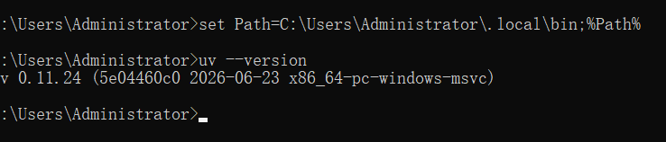

# kamaCalude

本地AI　Agent系统。`kama-core` 作为常驻守护线程处理所有任务，`kama`(CLI) 和`kama-tui`(TUI) TCP loopback与之通信。

## 环境要求

| 依赖 | 版本      |
|------|---------|
|操作系统| macOs / Linux |
|Pyhton| 3.12.x  |
|[uv](https://docs.astral.sh/uv/) | 0.4+    |

安装uv(若未安装)
Mac / Linux
```bash
cur -LsSf https://astral.sh/uv/install.sh | sh
```
windows
```bash
irm https://astral.sh/uv/install.ps1 | iex
```
安装成功后可通过命令查看


## 快速开始

```bash
git clone <repo> && cd KamaClaude
uv sync
cp .env.example .env # 按需修改

uv .run kama-core & # 启动守护进程（后台）
uv run kama ping # 验证连通：应返回pong
uv run kama --version # 应输出 0.0.1
```

## 文档
- **[RUNBOOK.md](./README.md)** 完整操作参考：配置、开发命令、故障排查
- **[WIRE_PROTOCOL.md](./WIRE_PROTOCOL.md)** —— IPC协议定义(由代码生成，勿手动修改)
